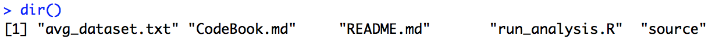

## Getting and Cleaning Data Course Project

This repository contains the results of the "Getting and Cleaning Data Course Project". The purpose of this course project is to "demonstrate my ability to collect, work with and clean a data set" (Course instruction).

You should also include a README.md in the repo with your scripts. This repo explains how all of the scripts work and how they are connected.

### Contents
This repository contains the following files:
* `Codebook.md` - 
* `README.md` - This file
* `avg_dataset.txt` - The output file of the `run_analysis.R` script, containing "independent tidy data set with the average of each variable for each activity and each subject"
* `run_analysis.R` - R script that downloads, cleans, summarizes the source data and outputs the tidy dataset
* `source\README.txt` - This is the README.txt file from the source data, describing the original experiment and the datafiles contained in the experiment
* `source\features_info.txt` - This file is also a file from the source data, explaining the features that were collected in the experiment.
* `source\UCI_HAR_Dataset.zip` - This zip file contains the complete original dataset

### How to run the R script
1. Fork this repository from Github to your local repository.
2. Open R Studio.
3. Change your working directory to where you forked the repository in step 1. using the `setwd()` command.
4. Execute the R script by using the following command: `source("./run_analysis.R")`. 

